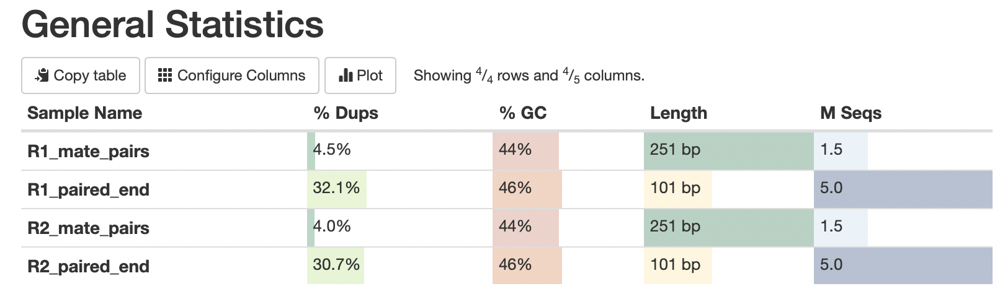
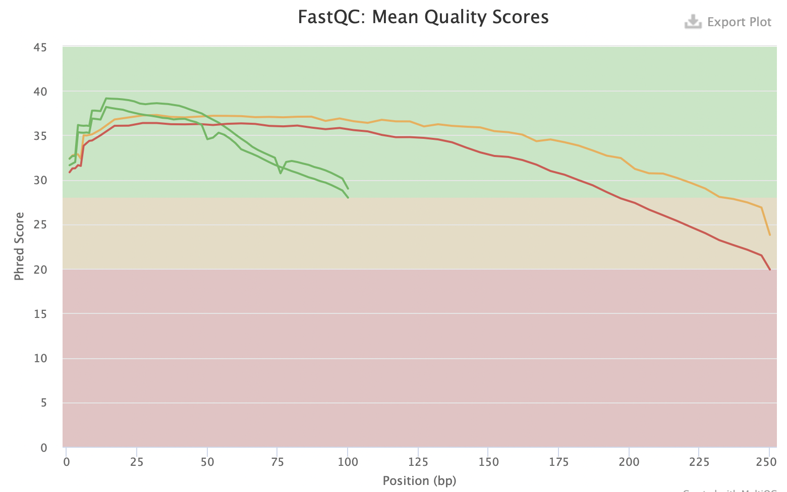
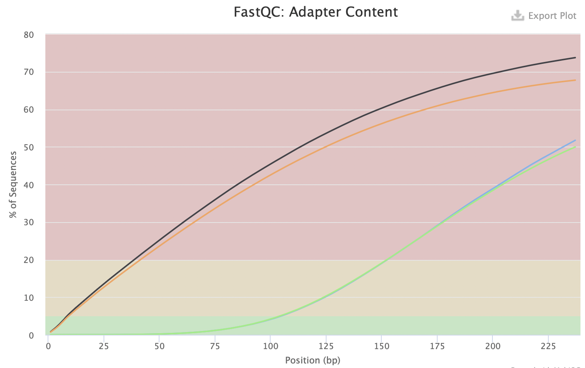
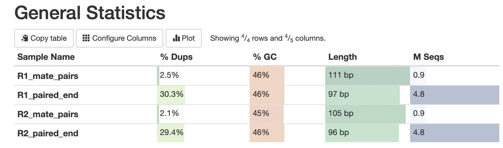
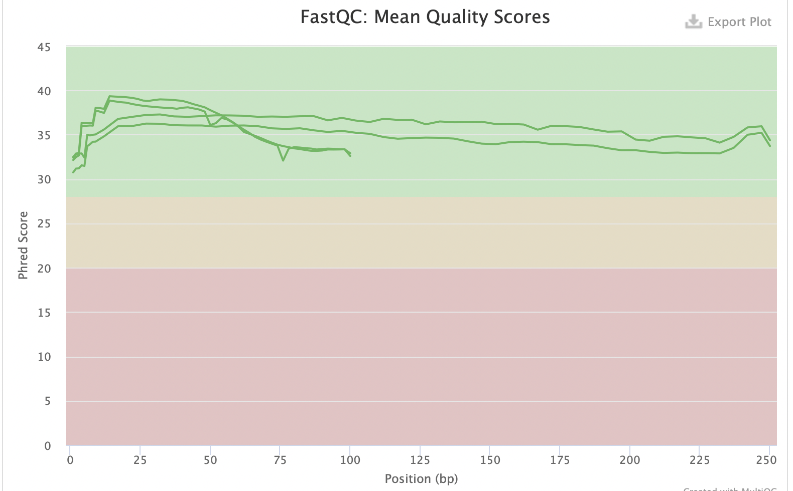
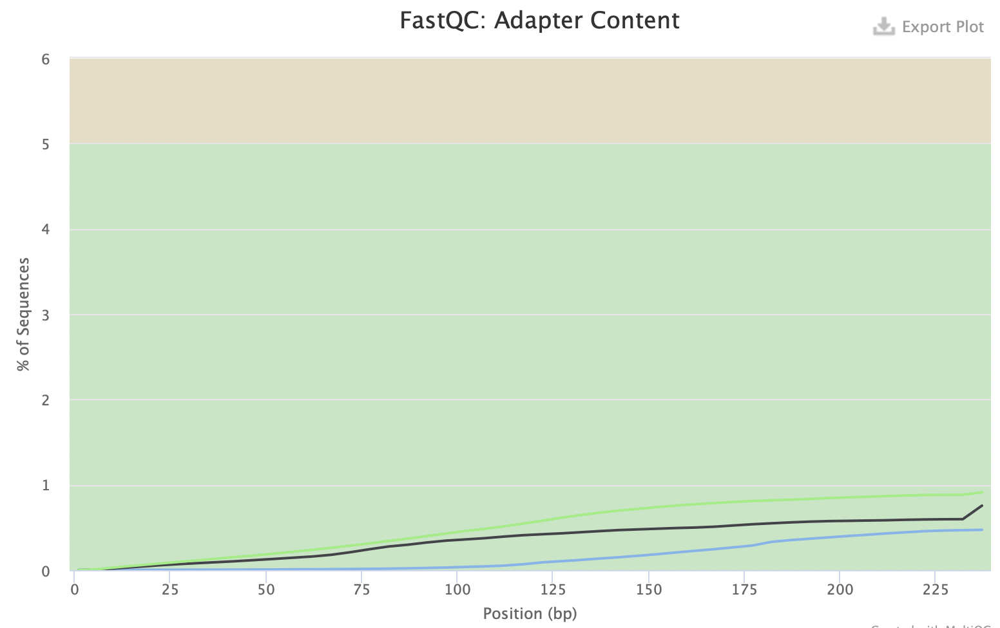

# hse21_hw1
### Создание символических ссылок на файлы
ln -s /usr/share/data-minor-bioinf/assembly/oilMP_S4_L001_R1_001.fastq

ln -s /usr/share/data-minor-bioinf/assembly/oilMP_S4_L001_R2_001.fastq

ln -s /usr/share/data-minor-bioinf/assembly/oil_R1.fastq

ln -s /usr/share/data-minor-bioinf/assembly/oil_R2.fastq

### Выбираем образец 1024 и случайно отбираем 5000000 чтений pair-end и 1500000 чтений mate pair
seqtk sample -s1024 oil_R1.fastq 5000000 > R1_paired_end.fastq

seqtk sample -s1024 oil_R2.fastq 5000000 > R2_paired_end.fastq

seqtk sample -s1024 oilMP_S4_L001_R1_001.fastq 1500000 > R1_mate_pairs.fastq

seqtk sample -s1024 oilMP_S4_L001_R2_001.fastq 1500000 > R2_mate_pairs.fastq

### Оцениваем качество исходных чтений с помощью программ fastQC и multiQC, получаем общие данные

mkdir fastqc

ls *.fastq | xargs -P 4 -tI{} fastqc -o fastqc {}

mkdir multiqc

multiqc -o multiqc fastqc

### Общая статистика для исходных чтений

### С помощью программ platanus_trim и platanus_internal_trim подрезаем чтения по качеству

platanus_trim R1_paired_end.fastq R2_paired_end.fastq 

platanus_internal_trim R1_mate_pairs.fastq R2_mate_pairs.fastq

### Оцениваем качество "подрезанных" чтений c помощью программ fastQC и multiQС, получаем по ним общие данные

mkdir trimmed_fastqc 

ls *trimmed | xargs -P 4 -tI{} fastqc -o trimmed_fastqc {} 

mkdir trimmed_multiqc 

multiqc -o trimmed_multiqc trimmed_fastqc

### Удаляем исходные файлы

rm R1_paired_end.fastq

rm R2_paired_end.fastq

rm R1_mate_pairs.fastq

rm R2_mate_pairs.fastq

### Общая статистика для подрезанных чтений

### Сравнив результаты для исходных и подрезанных чтений, можно сделать следующие выводы:

1) Mean quality scores после удаления праймеров переместился в зеленую зону 

2) Уменьшились длины последовательностей 

3) Уменьшился процент содержания адаптеров

### Собираем контиги и скаффолды

time platanus assemble -o Poil -t 2 -m 28 -f R1_paired_end.fastq.trimmed R2_paired_end.fastq.trimmed 2> assemble.log

time platanus scaffold -o Poil -t 2 -c Poil_contig.fa -IP1 R1_paired_end.fastq.trimmed R2_paired_end.fastq.trimmed -OP2 R1_mate_pairs.fastq.int_trimmed R2_mate_pairs.fastq.int_trimmed 2> scaffold.log

### Код для анализа контигов в src
    
### Анализ контигов

contig_file = open('Poil_contig.fa', 'r')
contig = contig_file.readlines()
analysis_c(contig)

### Результат

Общее количество контигов:  600
Суммарная длина контигов:  3923404
Длина самого длинного контига:  179304
N50:  47798

### Анализ скаффолдов

scaffold_file = open('Poil_scaffold.fa', 'r')
scaffold = scaffold_file.readlines()
analysis_s(scaffold)

### Результат

Общее количество скаффолдов:  70
Суммарная длина скаффолдов:  3872710
Длина самого длинного скаффолда:  3831215
N50:  3831215

### Поиск наибольшего скаффолда

for line in scaffold:
    if int(line.split('_')[1][3:]) == 3831215:
        print(line)
        break

### Записываем в файл

echo scaffold1_len3831756_cov232 > max_scaffold.txt

seqtk subseq Poil_scaffold.fa max_scaffold.txt > max_scaffold.fa
